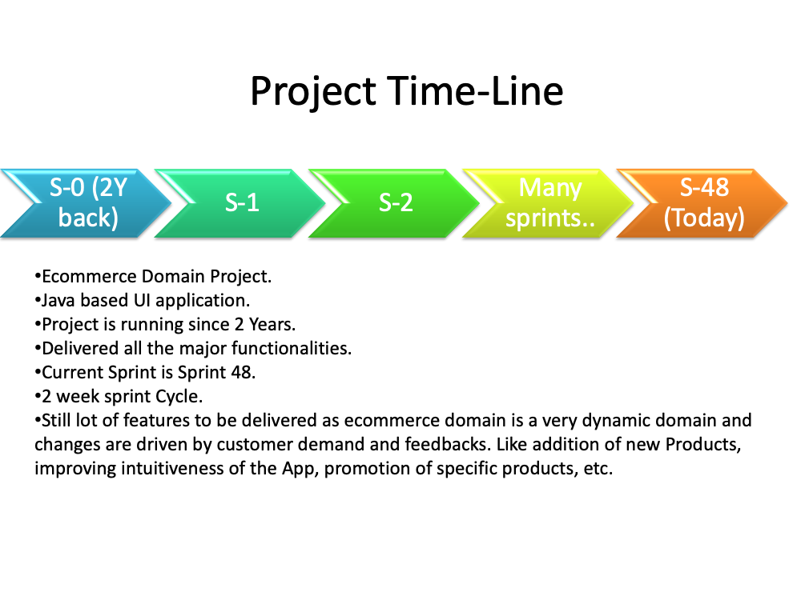
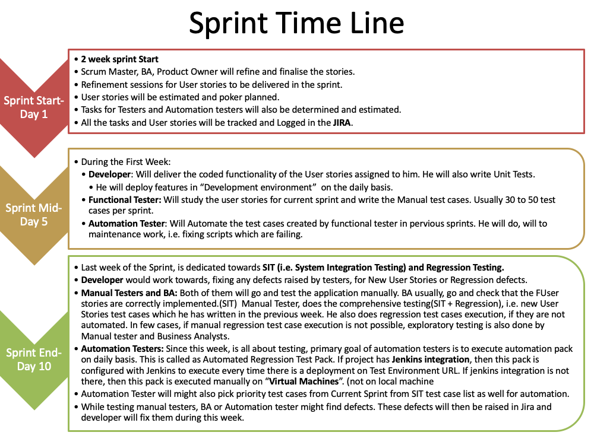
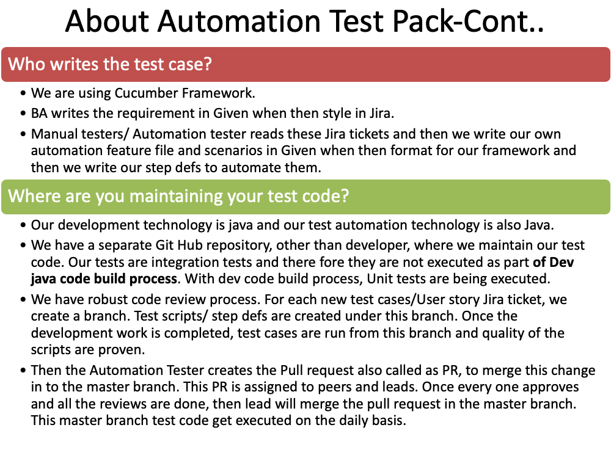
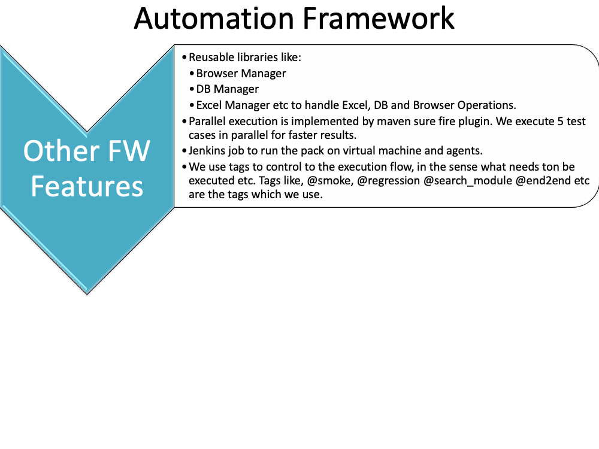

# tutorial-explain-project-and-fw
---
#### Description:
This repo contains the slide with tutorial on how to explain the project and automation testing framework. This is for reference purposes only and you should build your answers on top of these.

---
#### Author:
* Created By: <b>Akash Tyagi.</b> Reach me out at: akashdktyagi@gmail.com
* Date: Jan-2020
---

>

>

>

>

>

>

>

>

>

>

>
